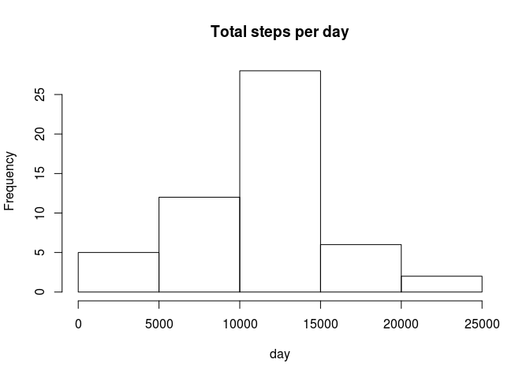
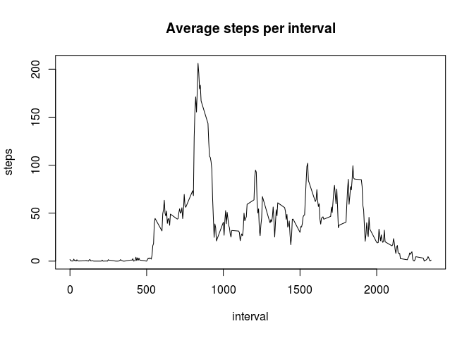
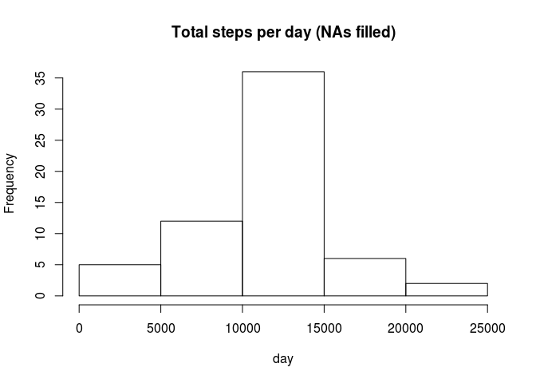
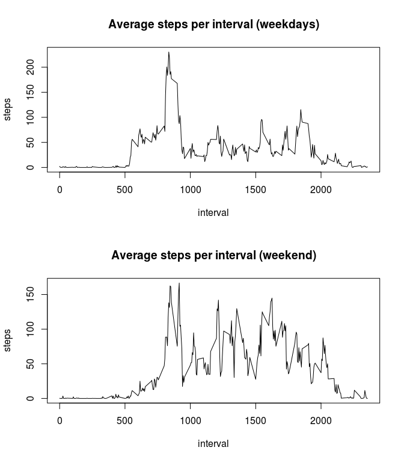

# Reproducible Research: Peer Assessment 1


## Loading and preprocessing the data

```r
data <- read.csv(unzip('activity.zip'),colClasses = c("numeric", "character", "numeric"))
```

## What is mean total number of steps taken per day?

```r
# Ignore missing values
data_NA_rm <- data[which(!is.na(data$steps)),]

# Calculate the total number of steps taken per day
steps_per_day <- aggregate(steps ~ date, data_NA_rm, sum)

# Histogram of the total number of steps taken each day
hist(steps_per_day$steps, main = "Total steps per day", xlab = "day")
```

 

```r
#Calculate the mean and median of the total number of steps taken per day
steps_mean <- prettyNum(round(mean(steps_per_day$steps),2))
steps_median <- prettyNum(median(steps_per_day$steps))
```

The mean of the total number of steps taken per day is 10766.19, the median is 10765.

## What is the average daily activity pattern?

```r
# Calculate average number of steps taken in each 5-minute interval, averaged across all days
steps_per_interval <- aggregate(steps ~ interval, data_NA_rm, mean)

# Time series plot of the interval and the average number of steps taken, averaged across all days
plot(x=steps_per_interval$interval,y=steps_per_interval$steps,type='l', 
     main="Average steps per interval",xlab='interval', ylab='steps')
```

 

```r
# Calculate interval, that contains the maximum number of steps (on average across all the days)
max_interval <- steps_per_interval$interval[steps_per_interval$steps == max(steps_per_interval$steps)]
```

The 5-minute interval, which on average across all the days contains the maximum number of steps is 835.


## Imputing missing values

My strategy for filling in all of the missing values in the dataset is to add the mean for that 5-minute interval.


```r
# Calculate and report the total number of missing values in the dataset
no_NA <- sum(is.na(data$steps))

# Create a new dataset that is equal to the original dataset but with the missing data filled in by adding the mean for that 5-minute interval.
data_filled <- data
for (i in 1: nrow(data_filled)){
  if(is.na(data_filled[i,'steps'])){
    data_filled[i,'steps'] <- steps_per_interval$steps[steps_per_interval$interval == data_filled[i,'interval']]
  }
}

# Calculate average number of steps taken in each 5-minute interval, averaged across all days
steps_per_day_filled <- aggregate(steps ~ date, data_filled, sum)

#Make a histogram of the total number of steps taken each day. 
hist(steps_per_day_filled$steps, main = "Total steps per day (NAs filled)", xlab = "day")
```

 

```r
#Calculate the mean and median of the total number of steps taken per day
steps_mean_filled <- prettyNum(round(mean(steps_per_day_filled$steps),2))
steps_median_filled <- prettyNum(round(median(steps_per_day_filled$steps),2))
diff_means <- as.numeric(steps_mean_filled) - as.numeric(steps_mean)
diff_medians <- as.numeric(steps_median_filled) - as.numeric(steps_median)
```

The dataset contains 2304 missing values. After filling the NAs, the mean of the total number of steps taken per day is 10766.19, the median is 10766.19. The difference between the filled and unfilled means is 0, the difference between the medians is 1.19.

## Are there differences in activity patterns between weekdays and weekends?

```r
#Create a new factor variable in the dataset with two levels – “weekday” and “weekend” 
data_filled$day <- weekdays(as.Date(data$date))
data_filled$day_type <- 'weekday'
data_filled$day_type[data_filled$day=='Samstag'] <- 'weekend'
data_filled$day_type[data_filled$day=='Sonntag'] <- 'weekend'
data_filled$day_type <- as.factor(data_filled$day_type)

#Make a panel plot containing a time series plot of the 5-minute interval and the average number of steps taken, averaged across all weekday days or weekend days.
steps_per_interval_filled <- aggregate(steps ~ interval+day_type, data = data_filled, FUN = mean)

# The assignment said, "feel free to use any plotting system in R", so I keep using the base system and create the panel equivalent
par(mfrow=c(2,1))
plot(x=steps_per_interval_filled$interval[steps_per_interval_filled$day_type=='weekday'],
     y=steps_per_interval_filled$steps[steps_per_interval_filled$day_type=='weekday'],type='l', 
     main="Average steps per interval (weekdays)",xlab='interval', ylab='steps')
plot(x=steps_per_interval_filled$interval[steps_per_interval_filled$day_type=='weekend'],
     y=steps_per_interval_filled$steps[steps_per_interval_filled$day_type=='weekend'],type='l', 
     main="Average steps per interval (weekend)",xlab='interval', ylab='steps')
```

 

